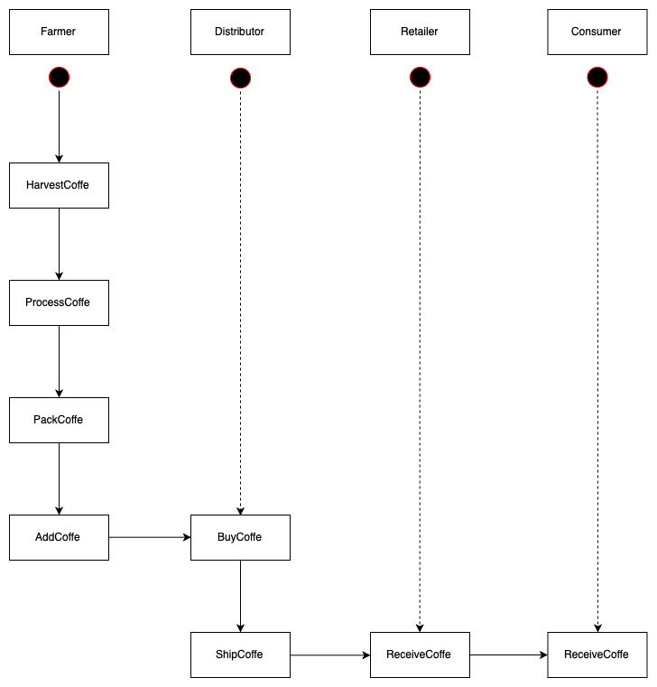

# Supply chain & data auditing

This repository containts an Ethereum DApp that demonstrates a Supply Chain flow.

## UML Diagrams

### Activity Diagram



### Sequence Diagram


### State Diagram


### Class (Data Model)


## Contract Address

```
Migrations: 0x80674df74a94a874ff26ba26eefcc178a623d89a
Tx Hash: 0x3189e51d5a10cc435026b2938b8b62df350e5897b1d84b6a2e08662f72e117d9

FarmerRole: 0x1f89ddeafea5aae4e0ee22f607d0e1375f6622f0
Tx Hash: 0x835cf263310936e1ee8cb636b88c4e4659261c80c675b6c797e3ea0aa97abf4a

DistributorRole: 0x014ec2fae9a9d25dc899afe28b93e4290d30b744
Tx Hash: 0x4b82f01ad3fb49de9d7a1c6f3653c430151187cb956e5f06f8527a612d7a15fb


RetailerRole: 0x41383a1f979286965e4450448dda0671d304b64b
Tx Hash: 0x8b773d31d6cba07ce48ff88afed7e0df4676ce3b1569d3f937c6606d6d6bf32d


ConsumerRole: 0x7a0d2d1884020a863e9993bb7b65c769b6f03e11
Tx Hash: 0xbd94d345b2bec14c2e510219afc3d4bf6dfc115e05379d42e027b3027567b60a


SupplyChain: 0x289519e6fb2c9e87430f6a116f188ec19e50ed8f
Tx Hash: 0x9712667ec6fe4e2c5bb2ccb9d854f714bebb459bbedadff8aa876106beb47c9d

```

## Program version numbers

* Node: `6.4.1`
* Truffle: `4.1.14`
* web3: `0.20.7`

## Libraries used

* truffle-hdwallet-provider: In order to deploy the contracts to the rinkeby network using infura.
